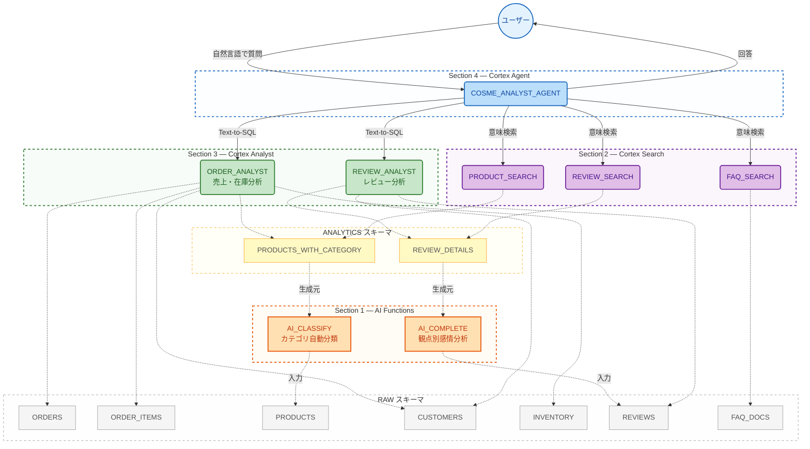

# Cortex AI ハンズオン — コスメECサイト

Snowflake の Cortex AI 機能を使って、**コスメECサイトの売上・レビュー・在庫データを自然言語で分析できる AI エージェント**を一気通貫で構築するハンズオンです。

## ハンズオンの流れ

| Section | やること | 学べる Snowflake 機能 |
|:-------:|----------|----------------------|
| 1 | AI でRAWデータを拡張する | AI Functions（AI_CLASSIFY / AI_COMPLETE） |
| 2 | FAQ・商品・レビューの意味検索を可能にする | Cortex Search Service |
| 3 | データの意味を定義する（売上分析・レビュー分析） | Semantic View（Cortex Analyst） |
| 4 | AI エージェントを組み立てる | Cortex Agent |
| 5 | 動かしてみよう！ | Snowflake Intelligence |
| 6 | エージェントを評価する | Cortex Agent Evaluations |

> Section 1〜5 の詳細な解説・SQL は `handson_notebook.ipynb` に記載しています。
> Section 6（エージェント評価）の詳細は `eval/README.md` を参照してください。

## アーキテクチャ



## データセット

| テーブル | 件数 | 概要 |
|---------|------|------|
| PRODUCTS | 50 | 商品マスタ（5カテゴリ） |
| CUSTOMERS | 200 | 顧客マスタ（年代・都道府県・会員ランク） |
| ORDERS | 1,000 | 注文ヘッダ（2025/04〜2026/03） |
| ORDER_ITEMS | 3,638 | 注文明細 |
| INVENTORY | 50 | 在庫 |
| REVIEWS | 500 | 商品レビュー（日本語） |
| FAQ_DOCS | 30 | FAQドキュメント |
| EVALS_TABLE | 21 | エージェント評価用 Ground Truth データ |

## セットアップ手順

```sql
-- 1. 環境構築 + データ投入（評価データセット・評価設定ステージ含む）
-- sql/setup.sql を Snowsight SQL Worksheet で実行

-- 2. ハンズオン（Snowflake Workspace Notebook で実行）
-- handson_notebook.ipynb を Snowflake にインポートして Section 1〜6 を実行

-- 3. クリーンアップ（ハンズオン終了後）
-- sql/cleanup.sql を実行
```

## リポジトリ構成

```
.
├── README.md
├── handson_notebook.ipynb        -- ハンズオン本体（Section 1〜6）
├── csv/                          -- サンプルデータ（7テーブル分）
├── eval/
│   ├── README.md                    -- エージェント評価の詳細ドキュメント
│   ├── evals.json                   -- 評価用 Ground Truth データ（21件、JSON）
│   └── cosme_agent_eval_config.yaml -- 評価メトリクス設定（YAML）
└── sql/
    ├── setup.sql                 -- 環境構築 + データ投入 + 評価データセット
    └── cleanup.sql               -- 全リソース削除
```
