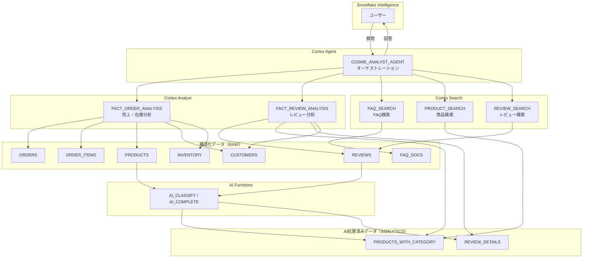

# Cortex AI ハンズオン — コスメECサイト

このハンズオンでは、Snowflake の Cortex AI 機能を使って**商品データの AI 分類・レビューの観点別感情分析**から、**自然言語で質問できる AI エージェント作成**までを一気通貫で構築します。

## 今日つくるもの

コスメECサイトの売上・在庫・レビュー・FAQデータを横断的に分析できる AI エージェントです。
完成すると、例えばこんな質問に自然言語で答えてくれます：

> 「月別売上推移を教えて」
>
> 「品質・効果の観点でポジティブ評価が多いブランドはどこですか？」
>
> 「開封済みの商品は返品できる？」
>
> 「敏感肌向けのスキンケア商品を探しています」
>
> 「在庫が少ない商品のうち、レビュー評価が高いものはどれ？」

## ハンズオンの流れ

| Section | やること | 学べる Snowflake 機能 |
|:-------:|----------|----------------------|
| 1 | AI でRAWデータを拡張する | AI Functions（AI_CLASSIFY / AI_COMPLETE） |
| 2 | FAQ・商品・レビューの意味検索を可能にする | Cortex Search Service |
| 3 | データの意味を定義する（売上分析・レビュー分析） | Semantic View（Cortex Analyst） |
| 4 | AI エージェントを組み立てる | Cortex Agent |
| 5 | 動かしてみよう！ | Snowflake Intelligence |

## Section 1: AI-Powered Data Pipeline（AI関数を活用する）

RAW スキーマのデータに Cortex AI 関数で付加情報を追加したテーブルを ANALYTICS スキーマに作成します。

### PRODUCTS_WITH_CATEGORY（AI カテゴリ付き商品マスタ）

商品名と説明文から **AI_CLASSIFY** で 5 つのカテゴリに自動分類します。

| カテゴリ | 対象商品 |
|---------|---------|
| スキンケア | 化粧水、乳液、美容液、クレンジング、洗顔、クリーム等 |
| メイク | ファンデーション、アイシャドウ、リップ、チーク等 |
| ヘアケア | シャンプー、コンディショナー、トリートメント等 |
| ボディケア | ボディソープ、ボディクリーム、ハンドクリーム等 |
| フレグランス | 香水、ボディミスト、ルームフレグランス等 |

### REVIEW_DETAILS（観点別レビュー分析）

各レビューを **AI_COMPLETE** で 5 つの観点に分解し、観点ごとの感情ラベル・スコア・要約を生成します。言及されていない観点は除外されます。

| 観点キー | 日本語名 |
|---------|---------|
| quality | 品質・効果 |
| texture | 使用感・テクスチャー |
| price | 価格・コスパ |
| skin_reaction | 肌トラブル・肌への影響 |
| delivery | 配送・梱包 |

## Section 2: Cortex Search（非構造化データの検索サービス）

テキストの**意味**を理解して検索するサービスを 3 つ作成します。キーワードの完全一致ではなく、「こういう意味のものを探して」という検索ができます。

| サービス名 | 検索対象 | 用途 |
|-----------|---------|------|
| FAQ_SEARCH | FAQドキュメント | 返品・配送・成分・スキンケア相談・ポイント |
| PRODUCT_SEARCH | 商品情報 | 商品名・ブランド・カテゴリ・商品説明文 |
| REVIEW_SEARCH | レビュー本文 | 口コミ・感想の意味検索 |

## Section 3: Cortex Analyst — Semantic View（構造化データの意味定義）

Cortex Analyst に「先月の売上は？」と聞いたとき、どのテーブルの・どのカラムを・どう集計すればよいかを AI が理解できるように、**データの意味（セマンティクス）** を定義します。

### セマンティックビューで定義すること

| 定義項目 | 何を定義する？ | 具体例 |
|---------|-------------|-------|
| テーブル | 分析対象のテーブルとその説明 | ORDERS, ORDER_ITEMS, PRODUCTS, CUSTOMERS |
| リレーションシップ | テーブル間の結合条件 | 注文ID = 明細の注文ID |
| ファクト | 集計対象の数値カラム | 売上金額、数量、単価、送料 |
| ディメンション | 分析の切り口となる属性 | 商品名、ブランド、カテゴリ、都道府県 |
| メトリクス | よく使う集計パターン | 総売上 = SUM(小計) |
| カスタムインストラクション | SQL生成ルール・対応範囲 | 金額フォーマット、ソート順、対応不可の質問 |

### 2つのセマンティックビュー

| ビュー名 | 対象データ | 主な分析内容 |
|---------|-----------|------------|
| FACT_ORDER_ANALYSIS | 注文・売上・在庫 | 売上トレンド、商品別売上ランキング、顧客セグメント分析、在庫アラート |
| FACT_REVIEW_ANALYSIS | レビュー・感情分析 | 星評価分析、観点別ポジネガ分析、商品別レビュー傾向 |

## Section 4: Cortex Agent（AI エージェント）

Section 2/3 で作成した 5 つのツールを組み合わせて、1 つの AI エージェントを構築します。

### Cortex Agent とは

Cortex Agent は、ユーザーの自然言語の質問を受け取り、**どのツールを使うべきかを自律的に判断して実行する AI オーケストレーター**です。

従来は「FAQ を検索するアプリ」「売上を集計する SQL」のように用途ごとにプログラムを書き分ける必要がありましたが、Cortex Agent を使うと **1 つのエンドポイントで複数のデータソースを横断的に扱えます**。

### Agent の動作フロー

```
ユーザーの質問
     │
     ▼
┌─────────────────────────────────────────────┐
│  ① 質問の意図を理解                           │
│     LLM が質問を解釈し、どのツールが最適かを判断  │
├─────────────────────────────────────────────┤
│  ② ツール選択・実行                           │
│     orchestration の指示に従い 1 つ以上の       │
│     ツールを選択して実行                        │
├─────────────────────────────────────────────┤
│  ③ 結果の統合・回答生成                        │
│     ツールの実行結果を統合し、response の指示に   │
│     従って自然言語で回答を生成                   │
└─────────────────────────────────────────────┘
```

複合的な質問（例:「保湿系商品の売上推移は？」）の場合、Agent は **複数ツールを順番に呼び出し**ます：

1. **PRODUCT_SEARCH** で「保湿系」の商品を特定
2. **ORDER_ANALYST** でその商品群の売上をSQL分析
3. 両方の結果を統合して回答

### CREATE AGENT の構造

`CREATE AGENT` は JSON の **SPECIFICATION** でエージェントの振る舞いを定義します。

```
CREATE AGENT ... FROM SPECIFICATION $${ JSON }$$
```

| キー | 役割 |
|------|------|
| `instructions.response` | 回答スタイルの指示（言語、フォーマット、トーンなど） |
| `instructions.orchestration` | ツール選択ルール（どの質問にどのツールを使うか） |
| `instructions.sample_questions` | サンプル質問（Snowflake Intelligence の UI に表示） |
| `tools` | 利用可能なツールの一覧と説明 |
| `tool_resources` | 各ツールが参照する具体的なリソース（Semantic View / Search Service） |

### 2 種類のツールタイプ

| タイプ | 役割 | ツールが行うこと |
|--------|------|-----------------|
| `cortex_analyst_text_to_sql` | 構造化データの分析 | Semantic View を参照して SQL を自動生成・実行し、数値で回答 |
| `cortex_search` | 非構造化データの検索 | Search Service でテキストを意味検索し、関連ドキュメントを返却 |

### 今回作成する Agent のツール構成

```
                 COSME_ANALYST_AGENT
                ┌────────┴────────┐
         Analyst (Text-to-SQL)   Search (意味検索)
         ┌─────┴─────┐       ┌────┼────┐
    ORDER_ANALYST  REVIEW   FAQ  PROD  REVIEW
    売上/在庫分析  _ANALYST  検索  検索   検索
         │          │        │    │      │
    Semantic    Semantic   Search Search Search
      View        View    Service Service Service
```

### orchestration — ツールの使い分けルール

orchestration フィールドに記述したルールに基づいて、Agent がツールを選択します。

| 質問の種類 | 使われるツール | 例 |
|-----------|-------------|---|
| FAQ・返品ポリシー・配送 | FAQ_SEARCH | 「返品ポリシーを教えて」 |
| 商品検索・おすすめ | PRODUCT_SEARCH | 「敏感肌向けスキンケア商品は？」 |
| レビュー内容の確認 | REVIEW_SEARCH | 「保湿力が高い口コミがある商品は？」 |
| 売上・注文・在庫の数値分析 | ORDER_ANALYST | 「先月の売上トップ5は？」 |
| 星評価・感情分析の集計 | REVIEW_ANALYST | 「品質の観点でポジティブ率が高いブランドは？」 |
| 複合的な質問 | Search → Analyst | 「保湿系商品の売上推移は？」 |

## Section 5: Snowflake Intelligence で動かしてみよう！

### 質問例

**売上分析（ORDER_ANALYST）**
- 「先月の売上トップ5の商品を教えてください。」
- 「月別の売上推移を教えてください。」
- 「ブランド別の売上ランキングを教えてください。」
- 「オーガニック商品の売上は全体の何パーセントですか？」

**レビュー分析（REVIEW_ANALYST）**
- 「品質・効果の観点でポジティブ評価が多いブランドはどこですか？」
- 「星1のレビューが多い商品はどれ？」
- 「観点別の感情スコアを比較してください。」

**FAQ検索（FAQ_SEARCH）**
- 「返品・交換のポリシーについて教えてください。」
- 「ポイント制度について教えてください。」

**商品検索（PRODUCT_SEARCH）**
- 「敏感肌向けのスキンケア商品を探しています。」
- 「オーガニック認証の商品にはどんなものがある？」

**レビュー検索（REVIEW_SEARCH）**
- 「保湿クリームのレビューで評判の良いものを教えて。」
- 「肌荒れしたというレビューがある商品を教えて。」

**複合的な質問（Search + Analyst）**
- 「敏感肌向け商品の売上推移を月別で見せてください。」
- 「スキンケアカテゴリの売上トップ3と、それぞれのレビュー傾向を教えて。」

### SQL から Agent を呼ぶ

```sql
SELECT SNOWFLAKE.CORTEX.AGENT(
    'COSME_EC_HANDSON.ANALYTICS.COSME_ANALYST_AGENT',
    '先月の売上トップ5の商品を教えてください。'
);
```

## アーキテクチャ



## データセット

| テーブル | 件数 | 概要 |
|---------|------|------|
| PRODUCTS | 50 | 商品マスタ（5カテゴリ: スキンケア/メイク/ヘアケア/ボディケア/フレグランス） |
| CUSTOMERS | 200 | 顧客マスタ（年代・都道府県・会員ランク） |
| ORDERS | 1,000 | 注文ヘッダ（2025/04〜2026/03、季節パターンあり） |
| ORDER_ITEMS | 3,638 | 注文明細（セット買いパターンあり） |
| INVENTORY | 50 | 在庫（15商品が発注点以下） |
| REVIEWS | 500 | 商品レビュー（星評価 1〜5、日本語） |
| FAQ_DOCS | 30 | FAQドキュメント（5カテゴリ × 6件） |

## セットアップ手順

```sql
-- 1. 環境構築 + データ投入
-- sql/setup.sql を実行

-- 2. ハンズオン（Snowflake Workspace Notebook で実行）
-- 02_handson_notebook.ipynb を Snowflake にインポート

-- 3. クリーンアップ（ハンズオン終了後）
-- sql/cleanup.sql を実行
```

## リポジトリ構成

```
.
├── README.md
├── 02_handson_notebook.ipynb              -- ハンズオン用 Snowflake Notebook（Section 1〜5）
├── csv/
│   ├── customers.csv                      -- 顧客マスタ（200件）
│   ├── faq_docs.csv                       -- FAQドキュメント（30件）
│   ├── inventory.csv                      -- 在庫（50件）
│   ├── order_items.csv                    -- 注文明細（3,638件）
│   ├── orders.csv                         -- 注文ヘッダ（1,000件）
│   ├── products.csv                       -- 商品マスタ（50件）
│   └── reviews.csv                        -- 商品レビュー（500件）
└── sql/
    ├── setup.sql                          -- 環境構築 + GitHub連携 + テーブル作成 + CSV読込
    └── cleanup.sql                        -- 全リソース削除
```
